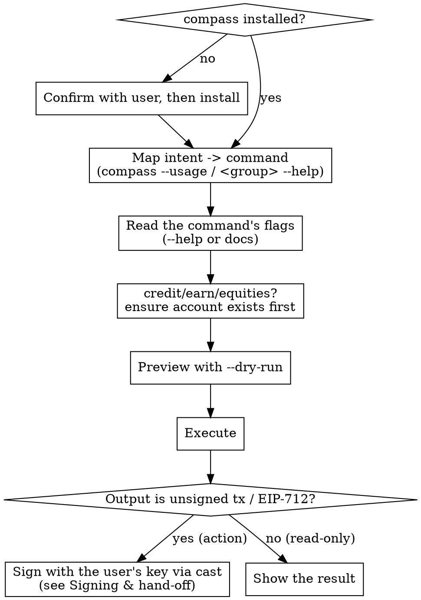

# Compass — on-chain DeFi via the `compass` CLI

## Overview

`compass` is a thin command-line wrapper over the Compass Labs **non-custodial** DeFi API. Action commands return an **unsigned transaction** (`{to, data, value, chainId}`) or **EIP-712 typed data** — the CLI never holds keys, signs, or broadcasts.

This skill is the "delegate to Compass" flow: install the CLI, translate the user's plain-English DeFi intent into the right command, preview it, run it, and hand any returned transaction to the user's wallet to sign.

## When to use

- User wants a DeFi action: "supply USDC to Aave", "find the best USDC vault and deposit", "borrow against my ETH", "swap X for Y", "open a 2x long on ETH", "buy tokenized TSLA", "withdraw my position".
- User invokes `/compass <intent>` or mentions the `compass` CLI.
- User asks portfolio / risk questions answerable from Compass market data (see `compass risk-recipes`).
- **Not for:** custodying keys (the *user's* key signs — see Signing & hand-off), price charts, or chains/protocols Compass doesn't support.

## Workflow



> 🖼️ Prefer a picture? A human-friendly version of this flow is in `workflow.excalidraw` (this folder) — open it with VS Code's Excalidraw extension or at excalidraw.com.

**0. Ensure the CLI is ready.** See "Setup" below.

**1. Map intent → command.** The **installed binary is the only source of truth** for command and flag names — they change between versions, so never rely on hardcoded names (including any in this skill). Discover live: `compass --usage` (full command + flag schema in one shot) or `compass <group> --help`. Use [command-catalog](#command-catalog) only to know *which capability area* to look in, then confirm the exact spelling against the binary. Prefer the **single highest-level command** (or one `bundle`) that achieves the user's whole goal — see "Delegate the whole goal" below.

**2. Read the command's flags before composing.** `compass <group> <command> --help`, or in the mono repo `cli-sdk/docs/compass_<group>_<command>.md`. Flags are often **nested** (`--venue.vault.vault-address`, not `--vault-address`). **Never infer flag names from the endpoint or API URL** — this is the #1 cause of failed first runs.

**3. Preview with `--dry-run`.** Prints the exact request (URL, headers, body) to stderr without calling the API. Verify the shape before spending a call.

**4. Execute, then sign.** Run the command. Read-only results (markets, positions, balances) you show or summarize directly. If the result is **unsigned** — a transaction or EIP-712 typed data — complete it with the **user's own key**; see **Signing & hand-off** below. `compass` itself never signs or broadcasts.

## Account-based products — ensure the account exists first

`credit`, `earn`, and `tokenized-equities` each act through a per-product **smart account** (a Safe) owned by the user. That account must exist (and, for credit/earn, be funded) before the main action, or it fails. So **before any credit / earn / equities action**:

1. **Check whether it's deployed on-chain.** These accounts have a **deterministic (counterfactual) address the CLI returns even when nothing is deployed there** — so an address in the output (or a `balances` result) does *not* prove the account exists. Verify deployment: `cast code <account-address> --rpc-url "$RPC_URL"` → empty (`0x`) means it isn't created yet.
2. **If not deployed, create it** — run the group's `create-account`, then fund it via the group's `transfer` where the group has one.
3. **Then** run the action.

One-time per owner per product per chain — skip if it's already deployed. ⚠️ Never equate "the CLI returned an `…_account_address`" with "the account exists": that address is predicted from the owner and returned regardless of deployment (it can even hold pre-funded tokens while undeployed). Confirm exact command names via `--help`; pure read-only commands (markets, quotes, positions) need no account.

**Perps (`global-markets-perps`) is different — no product account.** It trades on Hyperliquid, so its one-time setup is `enable-unified-account` + `deposit` USDC (plus `approve-builder-fee` / `ensure-leverage` if needed) — not a `create-account`. See the perps recipe in [recipes](#recipes).

## Delegate the whole goal — one command, one transaction

Compass is for *delegating execution*, not hand-orchestrating low-level steps. Map the user's **goal** to the **single highest-level command** that achieves it, and prefer **one atomic transaction**:

- One command does it (a single deposit / borrow / order command) → use that.
- Goal needs several actions (rebalance a portfolio, move funds between vaults, swap-then-deposit) → combine them into **one bundle** (each product exposes a `bundle`-style command — confirm its exact name via `--help`): a single atomic, all-or-nothing transaction the user signs **once**.
- **Anti-pattern — do NOT do this:** a chain of separate signed transactions — withdraw (sign) → swap (sign) → deposit (sign) — when one `bundle` does it in a single signature. "Rebalance across 3 vaults" is **one** bundle tx, not ~20 transactions.

Why: one signature, atomic execution (no half-done state if a later step fails), far less gas. **There is no `rebalance` command** — a rebalance *is* a `bundle` of withdraw/swap/deposit actions (see [recipes](#recipes) recipe 2). If unsure a single command exists, check `compass --usage` before falling back to multiple steps.

## Signing & hand-off — completing an action

Action commands return something **unsigned**; `compass` never signs, holds keys, or broadcasts. Complete it with the **user's own key** via [`cast`](https://book.getfoundry.sh/cast/) — full guide in [signing](#signing). Two cases:

- **Unsigned transaction** `{to, data, value, chainId}` (deposit, borrow, manage, bundle…) → sign + broadcast. Pass the `data` hex in the `[SIG]` slot — `cast` takes raw calldata there:
  ```bash
  cast send <to> <data> --value <value> --rpc-url "$RPC_URL" --account <keystore>
  ```
  Default to **sign-only** (`cast mktx` → hand back the signed tx, or `cast publish` it) and **broadcast only after the user confirms** — it spends funds irreversibly.
- **EIP-712 typed data** (perps/equities orders, gas-sponsorship) → sign off-chain, feed the signature to the **second** compass command:
  ```bash
  cast wallet sign --data --from-file td.json --account <keystore>    # → 0x<sig>, then: compass … execute --signature 0x<sig>
  ```

**Keys stay with the user:** sign from an encrypted keystore (`cast wallet import <name>`) or `--ledger`/`--trezor` — never `--private-key` inline (it leaks to shell history and `ps`).

## Setup (do once)

Check first: `compass version`. If it's missing, **tell the user the exact command and confirm before running it** (install modifies their system):

- **In the mono repo:** use the local `cli-sdk/compass` binary directly, or `go install github.com/CompassLabs/cli/cmd/compass@latest`.
- **Standalone (recommended for agents — non-interactive):**
  ```bash
  curl -fsSL https://compasslabs.ai/install.sh | bash      # macOS / Linux
  iwr -useb https://compasslabs.ai/install.ps1 | iex       # Windows (PowerShell)
  ```
  Installs to `/usr/local/bin`, auto-falling back to `$HOME/.local/bin` if that isn't writable; set `COMPASS_INSTALL_DIR` to force a directory (ensure it's on `PATH`).
- **Manual:** binaries on the [releases page](https://github.com/CompassLabs/cli/releases).

**Check it's current — this CLI changes fast.** Command names and flags have changed across versions (groups renamed, subcommands restructured), so a stale binary is a top cause of "unknown command/flag" errors. Don't memorize names — read them from the installed binary (step 1), and keep it reasonably current:

```bash
compass version                                                          # installed
curl -fsSL https://api.github.com/repos/CompassLabs/cli/releases/latest | grep -o '"tag_name": *"[^"]*"'   # latest
```

If it's behind, offer to update (re-run the installer — it fetches latest — or `go install …@latest`); confirm before installing.

Then authenticate (env var is the most reliable for agents; get a key at <https://compasslabs.ai/login>):

```bash
export COMPASS_API_KEY_AUTH=ck_...   # note the _AUTH suffix — NOT COMPASS_API_KEY
compass whoami                        # verify auth + connectivity
```

Do **not** run `compass configure` non-interactively — it opens a TUI. Agent-mode (structured errors + default TOON output) auto-enables when `CLAUDE_CODE` / `CURSOR_AGENT` is detected; no flag needed.

## Critical rules — internalize before composing any command

| Rule | Why it matters |
|------|----------------|
| Auth env var is `COMPASS_API_KEY_AUTH` | `COMPASS_API_KEY` is silently ignored → 401 |
| Pass **plain** values; read enum options from `--help` (e.g. `--chain base`) | Recent builds accept plain values directly. **Only** if an *optional* string flag errors with `unmarshalling json response body` (older CLI versions) do you JSON-quote that one flag: `--chain '"base"'` |
| Never quote required/enum flags | `--borrow-token '"USDC"'` sends literal `"USDC"` → "Unknown token symbol" 422 |
| Read the flag **Description**, ignore the metavar | Metavars like `--amount from_token` are generator noise, not syntax |
| `-o table` does **not** unwrap list envelopes | Use `--jq '.vaults'` to drill into `{total, …, vaults:[…]}` |
| Prefer `-o toon` or `--jq` for results you feed back to yourself | 30–60% fewer tokens than JSON |
| `compass` never signs/holds keys/broadcasts | Action output is unsigned (tx / EIP-712) → complete it with the user's key via `cast` (see "Signing & hand-off"); broadcast only after the user confirms |
| Never put a raw private key on the CLI | `--private-key 0x…` leaks to shell history + `ps` → use `cast`'s `--account` (encrypted keystore) or `--ledger`/`--trezor` |
| Product account first (credit / earn / equities) | The account has a deterministic address the CLI returns **even when undeployed** — check it's actually deployed (`cast code <addr>` → `0x` = not created), don't just trust that an address came back; if undeployed, `create-account` + fund, then act. **Perps has no product account** — one-time `enable-unified-account` + `deposit` |

Full error-recovery table: [error-recovery](#error-recovery). Worked end-to-end recipes: [recipes](#recipes). Signing & broadcasting: [signing](#signing).

## Quick reference

| Goal | Flag |
|------|------|
| Preview without calling the API | `--dry-run` |
| Extract one field/array for the next step | `--jq '.path'` |
| Compact output for your own context | `-o toon` |
| Human-readable result for the user | default (`pretty`) |
| Verbose request/response diagnostics | `--debug` |
| Risk math (LLTV cascade, JTD, correlation) | `compass risk-recipes` |


---

<a id="command-catalog"></a>

# Compass capability map

> **Names are version-specific — this maps *what Compass can do* to *where to look*, not exact syntax.** Get the real group names, subcommands, and flags from the binary:
> - `compass --help` — the product groups this version has
> - `compass <group> --help` — that group's subcommands
> - `compass --usage` — every command + flag in one shot
>
> Treat every name below as a **pointer**, not gospel. Groups and subcommands have been renamed and restructured across releases.

## How to go from intent to a command

1. `compass --help` → see this version's product groups.
2. Pick the group matching the user's intent (table below).
3. `compass <group> --help` → list its commands; pick the action.
4. `compass <group> <command> --help` → exact flags (watch for nested `--a.b.c`).

## Intent → capability area

| User wants… | Capability area | Notes |
|-------------|-----------------|-------|
| Earn yield — deposit/withdraw in vaults (ERC‑4626 / Morpho), Aave, or Pendle; list markets; positions | **Earn / yield** | one `manage`-style command does deposit *and* withdraw across venue types, chosen via a nested `--venue.*` flag (vault / Aave / Pendle) |
| Lend / borrow against collateral; repay | **Credit / lending** | |
| Perpetual futures — open/close long-short, market/limit orders | **Perps** | group name has changed across versions — find it via `compass --help`. Orders are *prepare → sign → execute* |
| Buy / sell tokenized equities (stocks) | **Tokenized equities** | group has been renamed across versions. *quote → order → sign → submit* |
| Pay gas on the user's behalf (sponsor) | **Gas sponsorship** | |
| Move tokens in/out of a product account, or swap within it | the per-product `transfer` / `swap` commands | |
| Auth / who am I / configure | **auth**, `whoami`, `configure` (TUI) | |
| Browse commands interactively | `explore` (TUI — not for non-interactive agents) | |
| Portfolio risk math | `risk-recipes` (prints formulas) | |

## Version-independent patterns

These hold regardless of exact names:

**Account prerequisites — check deployment, create if missing.** `credit`, `earn`, and `tokenized-equities` each act through a per-product smart account (a Safe) that must be **deployed** (and, for credit/earn, funded) first. Its address is **deterministic/counterfactual** — the CLI returns it even when nothing is deployed there, so don't read "an address came back" (or zero balances) as "it exists." Check on-chain deployment (`cast code <account-address>` → `0x` = not created); if undeployed, run the group's `create-account` + `transfer`, then act. One-time per owner per product per chain. **Perps (`global-markets-perps`) has no product account** — it trades on Hyperliquid: one-time `enable-unified-account` + `deposit` (not `create-account`).

**Multi-action → one bundle.** For any goal needing more than one action (rebalance, move between vaults, swap-then-deposit), use the product's **bundle**-style command (takes an `--actions '[…]'` list) to combine them into a **single atomic transaction**. Don't chain separate signed txs. There is no `rebalance` command — a rebalance *is* a bundle. See [recipes](#recipes).

**Prepare → sign → submit.** Some actions return EIP-712 / order data for the user to sign, then a second command submits the signature:
- perps order commands → sign → the perps **`execute`** command
- the equities **`order`** command → sign → its **order-submit** command
- any action with the **gas-sponsorship** flag → sign → the **gas-sponsorship prepare** command

**Read-only vs action.** List / markets / positions / balances / quote commands are read-only — show the result. Deposit / borrow / order / manage / bundle commands return an unsigned tx or EIP-712 → complete it with the user's key (`cast` — see [signing](#signing)); compass never signs.


---

<a id="error-recovery"></a>

# Compass CLI error recovery

Most first-run failures are flag-parsing or auth, not the API. Diagnose with this table before retrying.

| Symptom | Diagnosis | Fix |
|---------|-----------|-----|
| `error unmarshalling json response body: invalid character 'b' …` on a flag | An **optional** string flag was parsed as JSON (older CLI versions only) | JSON-quote just that flag: `--chain '"base"'`. The message says "response body" but it's actually flag parsing. Recent builds accept plain values. |
| API returns `Unknown token symbol` though the symbol is correct | A **required** flag was over-quoted, sending literal `"USDC"` | Drop the quotes on required/enum flags: `--borrow-token USDC` |
| `unknown command`/`unknown flag` for something you expected | Name is wrong for this version (groups/subcommands change between releases) | Re-list from the binary: `compass --help`, `compass <group> --help`, `compass --usage`. If behind the latest release, update the CLI and retry |
| `unknown flag: --foo` | Inferred a flag name that doesn't exist | Re-read `compass <cmd> --help`; look for the **nested** form (`--venue.vault.foo`) |
| `missing required flag: --foo` | Required flag absent | Add it; check the doc for nested required flags |
| `HTTP 401 … API key missing or invalid` | Auth not set or wrong var | `export COMPASS_API_KEY_AUTH=…` (note the `_AUTH` suffix) and re-run |
| `HTTP 422` | Request body validation | Read the response for which field failed; nested objects often need a type discriminator (e.g. `{"type":"VAULT", …}`) |
| `HTTP 4xx` (other) | Domain logic: insufficient balance, bad address, etc. | Surface verbatim to the user — usually actionable |
| `HTTP 5xx` | Backend issue | Retry once with `--debug`; if persistent, surface to user |
| `command not found: --foo` (zsh) | Trailing whitespace after a `\` line-continuation broke parsing | Re-run as a single line, or strip trailing spaces |
| `-o table` shows a tiny scalar table, hides the list | `table` doesn't unwrap the envelope `{total, …, items:[…]}` | Use `--jq '.items'` (or the real array key) |
| A metavar like `--amount from_token` looks like required syntax | It's generator noise from an OpenAPI example | Ignore the metavar; read the **Description**; pass the real value |

## JSON-quoting: default to plain

- **Default to plain values.** Recent CLI builds list enum options in `--help` (e.g. `--chain base`) and accept them directly.
- **Older versions** parsed *optional* string query-param flags as JSON (`json.Unmarshal` on the raw value), so a bare word failed with "unmarshalling json response body". Only then, JSON-quote just that flag: `--chain '"base"'`.
- **Required** and **enum** flags always take plain values — never quote them. Over-quoting (`--token-in '"USDC"'`) sends a literal `"USDC"` → confusing "Unknown token symbol" 422.
- Flags that historically hit the optional-flag bug: `--chain`, `--asset-symbol`, `--underlying-symbol`, `--category`, `--search`, `--interval`, `--range`, `--asset`.

## Quick health checks

```bash
compass version                 # is it installed?
compass whoami                  # is auth working?
compass <group> <cmd> --dry-run …   # what request would this send?
compass <group> <cmd> --debug …     # full request/response to stderr
```


---

<a id="recipes"></a>

# Compass patterns

> **Patterns, not exact syntax.** Command and flag *names* change between versions — always resolve them from the binary. The blocks below are **illustrative shapes**: angle-bracket placeholders (`<earn-group>`, `<manage-cmd>`) mean "find the real name via `--help`". Flags shown are typical but confirm them too.

## The loop for every action

```bash
compass --help                          # which product groups exist
compass <group> --help                  # which command does the action
compass <group> <command> --help        # exact flags (watch for nested --a.b.c)
compass <group> <command> … --dry-run   # verify the request shape, no API call
compass <group> <command> …             # run → sign the unsigned tx / EIP-712 with the user's key (see signing.md)
```

Pass plain values by default; JSON-quote a single flag only if it errors with `unmarshalling json response body` (older versions). Read-only results you show directly; action results (unsigned tx / EIP-712) go to the user's wallet — the CLI never signs. How to actually sign (the `cast` commands for each output type) and broadcast: see [signing](#signing).

## Deposit into a yield venue
Inputs the `manage`-style command needs: a **venue** (vault address, Aave token, or Pendle market — usually a nested `--venue.*` flag), an **action** (deposit/withdraw), an **amount**, the **owner**, the **chain**. Find a venue first via the vault/market listing command.
> Prereq: deposits move funds from the user's **Earn Account** — create + fund it first if needed.
```bash
# illustrative — confirm names/flags via --help
compass <earn-group> <list-vaults> --chain base --asset-symbol USDC --order-by tvl_usd --direction desc --jq '.vaults'
compass <earn-group> <manage> --venue.vault.vault-address 0x<v> --action DEPOSIT --amount 100 --owner 0x<o> --chain base
```

## Rebalance / any multi-step → ONE bundle  ⭐
Build the action list and submit it as a single atomic transaction (one signature) via the product's bundle command. The `action_type` values (`V2_MANAGE`, `V2_SWAP`, …) are API-level and more stable than CLI names.
```bash
compass <earn-group> <bundle> --owner 0x<o> --chain base --actions '[
  {"body":{"action_type":"V2_MANAGE","venue":{"type":"VAULT","vault_address":"0x<A>"},"action":"WITHDRAW","amount":"100"}},
  {"body":{"action_type":"V2_SWAP","token_in":"USDC","token_out":"AUSD","amount_in":"100","slippage":"0.5"}},
  {"body":{"action_type":"V2_MANAGE","venue":{"type":"VAULT","vault_address":"0x<B>"},"action":"DEPOSIT","amount":"100"}}
]'
# → ONE unsigned tx for the whole rebalance. There is no rebalance command; this bundle is the rebalance.
```

## Borrow / repay (credit)
Inputs: owner, chain, collateral token, borrow/repay token, amount. Prereq: a Credit Account (create + fund). Combine e.g. borrow+swap or repay+withdraw atomically with the credit bundle command. Each action returns an unsigned tx.

## Perps order — prepare → sign → execute
One-time: enable the perps account, deposit USDC (and approve a builder fee if you'll use one). Then an order command (market/limit) **prepares** EIP-712 → user signs → submit via the perps **`execute`** command. Order inputs: owner, asset ticker (e.g. `AAPL`), side (`buy`/`sell`), size, optional slippage. Read-only: opportunities, positions, candles, activity.
```bash
compass <perps-group> <market-order> --owner 0x<o> --asset AAPL --side buy --size 10 --slippage-percent 1
# user signs the returned EIP-712, then:
compass <perps-group> execute --action '<from prepare>' --nonce <n> --signature 0x<sig>
```

## Tokenized equity order — quote → order → sign → submit
Quote (read-only) → order (returns an order message + hash) → user signs off-chain → submit via the order-submit command. Track via order-status; cancel via the cancel command. Prereq: create the account once.

## Gas-sponsored action (sponsor pays gas)
Add the gas-sponsorship flag to an action to get EIP-712 instead of a tx → user signs → submit to the **gas-sponsorship prepare** command with the sponsor as sender → sponsor broadcasts and pays gas.

## Risk / portfolio analysis
`compass risk-recipes` prints the formulas (LLTV cascade, jump-to-default, vault correlation, withdrawable share of TVL) with jq snippets. LLTV cascade is the one to get right: Morpho ships LLTV as a uint256 scaled by 1e18, and bad debt is continuous (`1 − 1/newLtv`), not a binary trip-flag.


---

<a id="signing"></a>

# Signing & broadcasting compass output

`compass` is **non-custodial**: every action command returns something **unsigned** — either an **unsigned transaction** `{to, data, value, chainId}` or **EIP-712 typed data**. The CLI never holds keys, signs, or broadcasts. This is how to complete that last step with the **user's own key**, using [Foundry's `cast`](https://book.getfoundry.sh/cast/).

> **Keys stay with the user.** Sign from an **encrypted keystore** or a **hardware wallet** — never paste a raw private key on the command line (it leaks into shell history and the `ps` process list). Set a keystore up once:
> ```bash
> cast wallet import my-wallet --interactive   # paste the key once → stored encrypted; thereafter use --account my-wallet
> ```
> For real funds prefer `--ledger` / `--trezor` over any software key.

## Which path? Look at what the command returned

| compass returned… | What you do | Tool |
|-------------------|-------------|------|
| **Unsigned transaction** `{to, data, value, chainId}` — deposit, borrow, manage, transfer, bundle… | sign a transaction, then broadcast it | `cast send`, or `cast mktx` + `cast publish` |
| **EIP-712 typed data** — perps & equities orders, gas-sponsorship | sign a message off-chain, feed the signature to the **second** compass command | `cast wallet sign` |

## A. Unsigned transaction → sign + broadcast

Pass compass's `data` hex in the `[SIG]` position — `cast` accepts raw calldata there (no function signature needed).

**Default — sign without broadcasting (most non-custodial), then let the user push it:**
```bash
cast mktx <to> <data> --value <value> --rpc-url "$RPC_URL" --account my-wallet   # → 0x<signedRawTx>
# hand 0x<signedRawTx> back to the user, or broadcast it on their explicit OK:
cast publish 0x<signedRawTx> --rpc-url "$RPC_URL"
```

**Or sign + broadcast in one step — only after the user confirms (this spends funds and is irreversible):**
```bash
cast send <to> <data> --value <value> --rpc-url "$RPC_URL" --account my-wallet
```
- `--value` is only needed when compass's `value` is non-zero.
- `cast` reads chain id, nonce, and gas from `--rpc-url`; the user supplies an RPC for the tx's `chainId` (e.g. `$BASE_RPC_URL`).
- If time has passed since the command ran, re-fetch the unsigned tx from compass before broadcasting (nonce / gas can drift).

## B. EIP-712 typed data → sign, then submit via compass

Save compass's EIP-712 JSON verbatim to a file, sign it, then feed the signature into the **second** compass command. (Command names are version-specific — confirm via `--help`.)
```bash
# a perps/equities order or a gas-sponsored action returns EIP-712 JSON → save it as td.json
cast wallet sign --data --from-file td.json --account my-wallet      # → 0x<signature>
```
Then submit:
```bash
compass <perps-group> execute --action '<from prepare>' --nonce <n> --signature 0x<signature>   # perps
# equities:        the order-submit command takes the signature
# gas-sponsorship: the gas-sponsorship prepare command takes --signature with --sender = the sponsor
```
`cast wallet sign` also accepts the JSON inline (`--data '<json>'`, skip `--from-file`) — a file is cleaner for large payloads.

## Always confirm before spending

Broadcasting (`cast send` / `cast publish`) and submitting a signed order move real funds and cannot be undone. Preview with compass `--dry-run` first, tell the user exactly what will happen, and proceed only on an explicit go-ahead.

## No Foundry installed? web3.py fallback

```python
# Unsigned tx: build an EIP-1559 dict (type=2) from compass's JSON, then:
signed = Account.sign_transaction(tx, key)          # key from the user's secret store — never hard-code
w3.eth.send_raw_transaction(signed.raw_transaction)
w3.eth.wait_for_transaction_receipt(signed.hash)
# EIP-712: Account.sign_typed_data(...) → pass the signature to the second compass command
```
