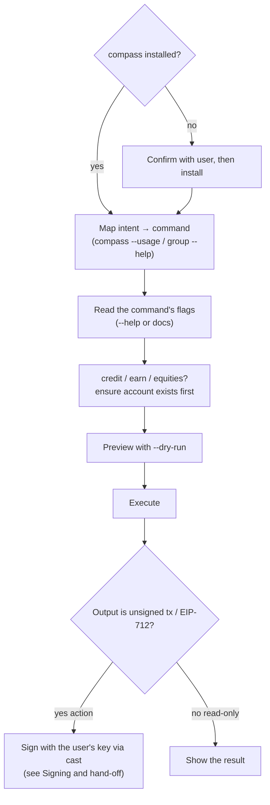

# Compass — DeFi skill for AI coding agents

Do on-chain DeFi from your coding agent by delegating to the [Compass Labs](https://compasslabs.ai) DeFi API through the `compass` CLI.

Describe an action in plain English — _"supply USDC to Aave"_, _"find the best USDC vault on Base and deposit 100"_, _"open a 2x long on ETH"_, _"buy tokenized TSLA"_ — and the agent installs the CLI if needed, finds the right command, previews it, runs it, and hands any resulting transaction to your wallet to sign.

**Non-custodial:** the CLI returns unsigned transactions / EIP-712 typed data. It never holds your keys, signs, or broadcasts.

One skill, multiple agents — the content in `skills/compass/` is shared; each agent just has a thin manifest.

## Install

### Claude Code
```text
/plugin marketplace add CompassLabs/compass-agent-skill
/plugin install compass@compass-labs
```

### Cursor / Codex
This repo ships `.cursor-plugin/` and `.codex-plugin/` manifests that point at the shared `skills/`. Install it through your agent's plugin mechanism (point it at this git repo), or copy `skills/compass/` into your agent's skills directory.

### Any other agent (universal)
Point your agent at **`AGENTS.md`** (or `GEMINI.md`) in this repo — it's the same guidance in the widely-read AGENTS.md format. Many agents (Codex, Aider, Cline, Gemini CLI, …) pick it up automatically when it's in the working directory.

## Use

```text
/compass find the highest-yield USDC vault on Base and deposit 100
```

Or just describe a DeFi action in chat — the skill activates on DeFi intents.

## How it works



## Requirements

- **A Compass API key:** `export COMPASS_API_KEY_AUTH=...` (get one at <https://compasslabs.ai/login>).
- **The `compass` CLI:** the skill installs it on first use, or:
  ```bash
  curl -fsSL https://compasslabs.ai/install.sh | bash      # macOS / Linux
  iwr -useb https://compasslabs.ai/install.ps1 | iex       # Windows
  # or
  go install github.com/CompassLabs/cli/cmd/compass@latest
  ```

## What it does NOT do

- Sign or broadcast transactions — that's your wallet (or the gas-sponsorship flow).
- Track positions over time — it's a stateless API client; query each time.
- Manage on-chain approvals — your wallet's job (or Permit2 via gas sponsorship).

## Layout (for maintainers)

- `skills/compass/` — the skill content, **single source of truth**.
- `.claude-plugin/`, `.cursor-plugin/`, `.codex-plugin/` — per-agent manifests, all pointing at `skills/`.
- `AGENTS.md`, `GEMINI.md` — generated universal-file representations of the skill (don't edit by hand).

This repo is published from the Compass monorepo via `tools/compass-agent-skill/publish.sh`; edit the skill there, then re-publish.

## Links

- compass CLI: <https://github.com/CompassLabs/cli>
- API docs: <https://docs.compasslabs.ai>
- Website: <https://compasslabs.ai>
