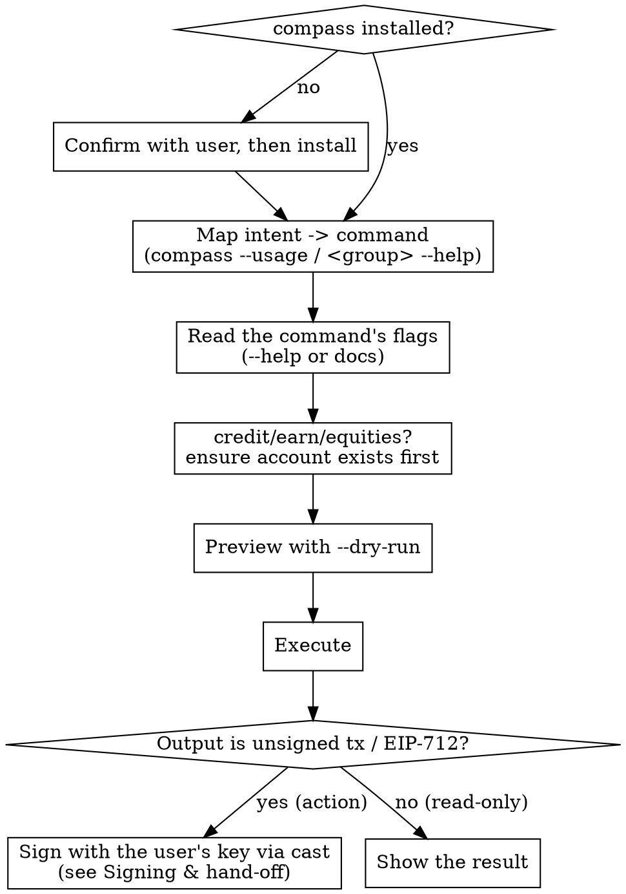

# Compass — on-chain DeFi via the `compass` CLI

## Overview

`compass` is a thin command-line wrapper over the Compass Labs **non-custodial** DeFi API. Action commands return an **unsigned transaction** (`{to, data, value, chainId}`) or **EIP-712 typed data** — the CLI never holds keys, signs, or broadcasts.

This skill is the "delegate to Compass" flow: install the CLI, translate the user's plain-English DeFi intent into the right command, preview it, run it, and hand any returned transaction to the user's wallet to sign.

## When to use

- User wants a DeFi action: "supply USDC to Aave", "find the best USDC vault and deposit", "borrow against my ETH", "swap X for Y", "open a 2x long on ETH", "buy tokenized TSLA", "withdraw my position".
- User invokes `/compass <intent>` or mentions the `compass` CLI.
- User asks portfolio / risk questions answerable from Compass market data (see `compass risk-recipes`).
- **Not for:** custodying keys (the *user's* key signs — see Signing & hand-off), price charts, or chains/protocols Compass doesn't support.

## Workflow



**0. Ensure the CLI is ready.** See "Setup" below.

**1. Map intent → command.** The **installed binary is the only source of truth** for command and flag names — they change between versions, so never rely on hardcoded names (including any in this skill). Discover live: `compass --usage` (full command + flag schema in one shot) or `compass <group> --help`. Use `references/command-catalog.md` only to know *which capability area* to look in, then confirm the exact spelling against the binary. Prefer the **single highest-level command** (or one `bundle`) that achieves the user's whole goal — see "Delegate the whole goal" below.

**2. Read the command's flags before composing.** `compass <group> <command> --help`, or in the mono repo `cli-sdk/docs/compass_<group>_<command>.md`. Flags are often **nested** (`--venue.vault.vault-address`, not `--vault-address`). **Never infer flag names from the endpoint or API URL** — this is the #1 cause of failed first runs.

**3. Preview with `--dry-run`.** Prints the exact request (URL, headers, body) to stderr without calling the API. Verify the shape before spending a call.

**4. Execute, then sign.** Run the command. Read-only results (markets, positions, balances) you show or summarize directly. If the result is **unsigned** — a transaction or EIP-712 typed data — complete it with the **user's own key**; see **Signing & hand-off** below. `compass` itself never signs or broadcasts.

## Account-based products — ensure the account exists first

`credit`, `earn`, and `tokenized-equities` each act through a per-product **smart account** (a Safe) owned by the user. That account must exist (and, for credit/earn, be funded) before the main action, or it fails. So **before any credit / earn / equities action**:

1. **Check** whether the owner already has that product's account — query the group's `positions` (or `balances`); an empty / "no account" result means it doesn't exist yet.
2. **If missing, create it** — run the group's `create-account`, then fund it via the group's `transfer` where the group has one.
3. **Then** run the action.

One-time per owner per product per chain — skip it if the account already exists. Confirm exact command names via `--help` (version-independent). Pure read-only commands (markets, quotes, positions) need no account.

**Perps (`global-markets-perps`) is different — no product account.** It trades on Hyperliquid, so its one-time setup is `enable-unified-account` + `deposit` USDC (plus `approve-builder-fee` / `ensure-leverage` if needed) — not a `create-account`. See the perps recipe in `references/recipes.md`.

## Delegate the whole goal — one command, one transaction

Compass is for *delegating execution*, not hand-orchestrating low-level steps. Map the user's **goal** to the **single highest-level command** that achieves it, and prefer **one atomic transaction**:

- One command does it (a single deposit / borrow / order command) → use that.
- Goal needs several actions (rebalance a portfolio, move funds between vaults, swap-then-deposit) → combine them into **one bundle** (each product exposes a `bundle`-style command — confirm its exact name via `--help`): a single atomic, all-or-nothing transaction the user signs **once**.
- **Anti-pattern — do NOT do this:** a chain of separate signed transactions — withdraw (sign) → swap (sign) → deposit (sign) — when one `bundle` does it in a single signature. "Rebalance across 3 vaults" is **one** bundle tx, not ~20 transactions.

Why: one signature, atomic execution (no half-done state if a later step fails), far less gas. **There is no `rebalance` command** — a rebalance *is* a `bundle` of withdraw/swap/deposit actions (see `references/recipes.md` recipe 2). If unsure a single command exists, check `compass --usage` before falling back to multiple steps.

## Signing & hand-off — completing an action

Action commands return something **unsigned**; `compass` never signs, holds keys, or broadcasts. Complete it with the **user's own key** via [`cast`](https://book.getfoundry.sh/cast/) — full guide in `references/signing.md`. Two cases:

- **Unsigned transaction** `{to, data, value, chainId}` (deposit, borrow, manage, bundle…) → sign + broadcast. Pass the `data` hex in the `[SIG]` slot — `cast` takes raw calldata there:
  ```bash
  cast send <to> <data> --value <value> --rpc-url "$RPC_URL" --account <keystore>
  ```
  Default to **sign-only** (`cast mktx` → hand back the signed tx, or `cast publish` it) and **broadcast only after the user confirms** — it spends funds irreversibly.
- **EIP-712 typed data** (perps/equities orders, gas-sponsorship) → sign off-chain, feed the signature to the **second** compass command:
  ```bash
  cast wallet sign --data --from-file td.json --account <keystore>    # → 0x<sig>, then: compass … execute --signature 0x<sig>
  ```

**Keys stay with the user:** sign from an encrypted keystore (`cast wallet import <name>`) or `--ledger`/`--trezor` — never `--private-key` inline (it leaks to shell history and `ps`).

## Setup (do once)

Check first: `compass version`. If it's missing, **tell the user the exact command and confirm before running it** (install modifies their system):

- **In the mono repo:** use the local `cli-sdk/compass` binary directly, or `go install github.com/CompassLabs/cli/cmd/compass@latest`.
- **Standalone (recommended for agents — non-interactive):**
  ```bash
  curl -fsSL https://raw.githubusercontent.com/CompassLabs/cli/main/scripts/install.sh | bash
  ```
  Installs to `/usr/local/bin` (may need sudo). To avoid sudo, prefix with `COMPASS_INSTALL_DIR="$HOME/.local/bin"` and make sure that dir is on `PATH`.
- **Manual:** binaries on the [releases page](https://github.com/CompassLabs/cli/releases).

**Check it's current — this CLI changes fast.** Command names and flags have changed across versions (groups renamed, subcommands restructured), so a stale binary is a top cause of "unknown command/flag" errors. Don't memorize names — read them from the installed binary (step 1), and keep it reasonably current:

```bash
compass version                                                          # installed
curl -fsSL https://api.github.com/repos/CompassLabs/cli/releases/latest | grep -o '"tag_name": *"[^"]*"'   # latest
```

If it's behind, offer to update (re-run the installer — it fetches latest — or `go install …@latest`); confirm before installing.

Then authenticate (env var is the most reliable for agents):

```bash
export COMPASS_API_KEY_AUTH=ck_...   # note the _AUTH suffix — NOT COMPASS_API_KEY
compass whoami                        # verify auth + connectivity
```

Do **not** run `compass configure` non-interactively — it opens a TUI. Agent-mode (structured errors + default TOON output) auto-enables when `CLAUDE_CODE` / `CURSOR_AGENT` is detected; no flag needed.

## Critical rules — internalize before composing any command

| Rule | Why it matters |
|------|----------------|
| Auth env var is `COMPASS_API_KEY_AUTH` | `COMPASS_API_KEY` is silently ignored → 401 |
| Pass **plain** values; read enum options from `--help` (e.g. `--chain base`) | Recent builds accept plain values directly. **Only** if an *optional* string flag errors with `unmarshalling json response body` (older CLI versions) do you JSON-quote that one flag: `--chain '"base"'` |
| Never quote required/enum flags | `--borrow-token '"USDC"'` sends literal `"USDC"` → "Unknown token symbol" 422 |
| Read the flag **Description**, ignore the metavar | Metavars like `--amount from_token` are generator noise, not syntax |
| `-o table` does **not** unwrap list envelopes | Use `--jq '.vaults'` to drill into `{total, …, vaults:[…]}` |
| Prefer `-o toon` or `--jq` for results you feed back to yourself | 30–60% fewer tokens than JSON |
| `compass` never signs/holds keys/broadcasts | Action output is unsigned (tx / EIP-712) → complete it with the user's key via `cast` (see "Signing & hand-off"); broadcast only after the user confirms |
| Never put a raw private key on the CLI | `--private-key 0x…` leaks to shell history + `ps` → use `cast`'s `--account` (encrypted keystore) or `--ledger`/`--trezor` |
| Product account first (credit / earn / equities) | Check the owner's product account exists (group `positions`); if not, `create-account` + fund, then act. **Perps has no product account** — its one-time setup is `enable-unified-account` + `deposit` |

Full error-recovery table: `references/error-recovery.md`. Worked end-to-end recipes: `references/recipes.md`. Signing & broadcasting: `references/signing.md`.

## Quick reference

| Goal | Flag |
|------|------|
| Preview without calling the API | `--dry-run` |
| Extract one field/array for the next step | `--jq '.path'` |
| Compact output for your own context | `-o toon` |
| Human-readable result for the user | default (`pretty`) |
| Verbose request/response diagnostics | `--debug` |
| Risk math (LLTV cascade, JTD, correlation) | `compass risk-recipes` |
